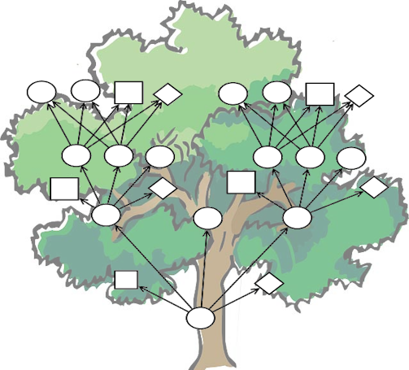
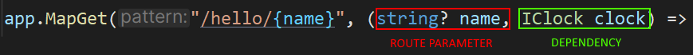

:sectnums:
:icons: font
:toc:
:source-highlighter: highlightjs
:data-uri:
:nofooter:
:sln-script-url: https://gist.github.com/haslingerm/f788296c1dbc2240653ea57ed223b49b

= Pool Guard -- Workshop

 > As we embark on the journey of implementing an access control system for a public outdoor pool, we are not merely creating a process for ticket validation and management—we are enhancing the experience of every visitor and ensuring the safety and enjoyment of our community. This assignment offers a unique opportunity to design a system that will transform the way we manage and monitor access to a beloved public facility, turning a simple pool visit into a well-organized and secure event. With our innovative approach, we aim to streamline operations, prevent unauthorized access, and create a welcoming environment where each visitor feels valued and assured of their safety.

As an introductory project for creating proper WebApis we start with leveraging the skills you gained last year in WMC by creating a simple (minimal) REST API.
This system will manage the tickets and access to the glorious outdoor pool of HTL Leonding.

== Project Setup

First, we need to create the project.
Hopefully you have the latest version of https://www.nuget.org/packages/HTLLeonding.Utility.Templates[the templates] installed!

[source,shell]
----
dotnet new leominiapi -n PoolGuard -o PoolGuard
----

Once the template has been scaffolded, open it in your IDE, build & run.
You should now have a simple API to greet people running on `http://localhost:5200`.

=== HTTP Request File

A very good way of testing a REST API ist to use a `.http` file.
Those request files are supported by all relevant IDEs and allow you to not only define, but also run various REST requests.
As an added benefit, those files can be checked into version control and shared with your team.

Our template already created a `PoolGuard.http` file for you.
Run the `GET` request and verify, that you get a valid response -- your API is ready!

== Minimal Web API

In ASP.NET Core there are two major, official ways for creating Web APIs:

. `Controller` based application
** More powerful & flexible feature wise
** Better structure, especially for larger projects
** Less (startup) performance focused and not AOT capable (we are talking about hundreds of thousands of requests per second here, congratulations if your app needs that!)
. Minimal API based applications
** Very similar to `Express` and other, similar web frameworks
** Can get you up and running very quickly
** Harder to maintain for larger projects
** Very (startup) performance focused and AOT capable

NOTE: An AOT compiled application will start very fast and consume a little less memory, while a 'regular' JIT-based application starts slower, consumes a bit more memory, but also has a higher throughput, because the JIT can dynamically optimize actual _hot paths_, something a static AOT compiler can't do. That makes AOT applications especially useful for serverless functions in the cloud where a small microservice is started and  stopped for every function and every request. On the other hand, a JIT-based application is better suited for larger, long-running services, where the startup time is not that important. Always pick the right tool for the job!

During the year -- once we add authentication & authorization, model validation, 3bases, many endpoints,... -- we will get to 'full', controller based applications, but for now we will stick with the minimal API approach.

The goal is that you are able to quickly create a simple Web API against which we can work when doing frontend development.
Most of the complicated things we will ignore for the moment and leave for later.

=== The first Endpoint

To begin, let's take a look at the endpoint defined in the template.
Don't worry about the initial parts of the code -- those are required to set up the application, and we will talk about them soon.
But for now, we focus on the thing we are most interested in: how to define a REST endpoint.

.Program.cs
[source,csharp]
----
app.MapGet("/hello/{name}", (string? name, IClock clock) => <1><2><3><4><5>
   {
       if (string.IsNullOrWhiteSpace(name))
       {
           return Results.BadRequest(); <6>
       }

       var now = clock.GetCurrentInstant();

       return Results.Ok(new Greeting(name, now)); <7>
   })
   .Produces<Greeting>(StatusCodes.Status200OK) <8>
   .Produces(StatusCodes.Status400BadRequest) <8>
   .WithName("Greetings") <8>
   .WithOpenApi(); <8>
----
<1> Similar to `Express`, we use `app.MapGet` to define a `GET` endpoint
<2> Next up is the _route_ -- in this case a _route parameter_ (`name`) is also defined
<3> Then we need to pass a _lambda_ function that will be executed when the endpoint is called. Good, that you are already very comfortable with lambdas!
<4> The first parameter of the lambda will be set to the value from the route parameter -- _for this to work the name *has* to match_ and the type must be compatible
<5> Finally, we also get an instance of `IClock` -- where is that coming from? _Who_ is calling this method and the lambda anyway, and _where_? 🤔🤔 We will talk about that in just a moment.
<6> Based on the required logic and the values submitted by the client, we can return different results and status codes (HTTP status codes are the same everywhere, so you can make use of your knowledge from WMC) -- in this case a required parameter (`name`) is missing, so we return a `BadRequest` result
<7> If everything is fine, we return a 200 status with a `Greeting` object (the object itself is not important, it is just an arbitrary `class`)
<8> At the end we can see a bunch of _extension methods_ which are used to configure the _metadata_ for OpenApi -- we'll talk about what that is later

If you run the `GET` request from the `PoolGuard.http` file, you should see a response similar to this:

[source,json]
----
{
  "message": "Hello, Schwammal!",
  "timestamp": "2024-08-11T16:46:43.7213775Z"
}
----

That works, because the application created by the template is configured to serialize the response objects to JSON.

*=> You have a working REST API!* 🎉

To add more endpoints, you can simply add more `app.MapGet`, `app.MapPost`, `app.MapPut`, `app.MapDelete`,... calls.

=== OpenApi

Before we continue, let's ask a question:

> How would someone else, without access to the code, know which endpoints exist and what to do with them?

That is a quite important question, because your are most likely not going to work on your project in isolation.
There are other teams, customers, suppliers, users etc. who all have an interest in the API you are providing.

A common way to communicate the structure and capabilities of a REST API is to use an OpenApi _specification_ (also commonly known as _Swagger_).
The template already prepared your Web API to automatically create a specification based on the _metadata_ of the endpoint(s).

You can test this by executing the second request in the `http` file, which will return the OpenApi specification of your application.
It looks something like this:

[source,json]
----
{
  "openapi": "3.0.1",
  "info": {
    "title": "PoolGuard",
    "version": "1.0" <1>
  },
  "paths": {
    "/hello/{name}": { <2>
      "get": {
        "tags": [
          "PoolGuard"
        ],
        "operationId": "Greetings",
        "parameters": [ <3>
          {
            "name": "name",
            "in": "path",
            "schema": {
              "type": "string"
            }
          }
        ],
        "responses": { <4>
          "200": {
            "description": "OK",
            "content": {
              "application/json": {
                "schema": {
                  "$ref": "#/components/schemas/Greeting" <5>
                }
              }
            }
          },
          "400": {
            "description": "Bad Request"
          }
        }
      }
    }
  },
  "components": {
    "schemas": {
      "Greeting": { <6>
        "type": "object",
        "properties": {
          "message": {
            "type": "string",
            "nullable": true,
            "readOnly": true
          },
          "timestamp": {
            "$ref": "#/components/schemas/Instant"
          }
        },
        "additionalProperties": false
      },
      "Instant": {
        "type": "object",
        "additionalProperties": false
      }
    }
  }
}
----
<1> The version of the API, this is important, because you are going to do _semantic versioning_ in the real world. However, for our needs this will stay at 1.0 forever 😉
<2> All routes are listed
<3> For each route the parameters and their types are listed
<4> The possible responses of the endpoint (a 500 is always an option, though, because it means the server itself panicked)
<5> If a _complex_ object is returned, a _schema_ of that object is referenced
<6> And here is the specification of the `Greeting` object

With this document we can not only learn a lot about an API without menacing trial & error, but there are also tools to _generate client stubs_ based on such a specification -- which can speed up client development.

=== Configuration

After this great success of having a working endpoint and knowing how to document it, we can take a look at the remaining pieces that make this Web API work.

Starting in the `Program.cs` file, we see the following:

.Program.cs
[source,csharp]
----
var builder = WebApplication.CreateBuilder(args); <1>

builder.Services.AddEndpointsApiExplorer(); <2>
builder.Services.AddOpenApi(); <2>
builder.Services.RegisterServices(); <3>
builder.Services.ConfigureServices(builder.Environment.IsDevelopment()); <4>

var app = builder.Build(); <5>

if(builder.Environment.IsDevelopment()) <6>
{
    app.MapOpenApi();
}

// endpoint

await app.RunAsync(); <7>

internal sealed class Greeting(string name, Instant timestamp) <8>
{
    public string Message => $"Hello, {name}!";
    public Instant Timestamp => timestamp;
}
----
<1> We want to build a web application, for that we need a builder (and apply the _builder pattern_)
<2> Needed for OpenApi, we will talk about that soon
<3> Registering services -- what are services? 🤔
<4> Configuring services -- what are these services?? 🤨
<5> Done configuring the builder, now we construct the application
<6> When running in development mode, we create a OpenApi endpoint
<7> Finally, we start the application! There is also a synchronous version of this method, but we prefer the async version
<8> Only the simple class we returned in the endpoint earlier

Lots of talk about services.
We will dive deeper and deeper into this topic over the course of the year, but to get started, imagine the following architecture:

[plantuml]
----
@startuml
package "Web Application" {
  [Endpoint] --> [Service]
  [Service] --> [Data Storage]
  [Service] --> [Service]
}

package "Client" {
  [ClientApp] -r-> [Endpoint]
}

note as n1
    Most of those arrows also point in
    the other direction (responses).
    Omitted here to make clear in which
    order components are becoming active
    when a request is made
end note
@enduml
----

* Clients talk to the endpoints (controllers), which are responsible for receiving the requests and calling the appropriate service.
After they receive the result from the service, they return a properly formatted response to the client.
** So they deal with all the REST-Tasks like routes, status codes, most of the validation, object (de)serialization (including DTOs),... but do not contain (a lot of) business logic.
** Also, they never talk to the data storage directly.
* Services are responsible for the actual business logic -- they are the heart of the application.
A service might call into the data storage.
It might also call other services.
It does not know anything about REST or the client, it just handles the business logic.
* Date Storage is a complex topic to which we will get later.
For the moment just imagine an few `List<T>` which contain some data we can get and store.

NOTE: 'Service' is a very broad term. There are not only the typical business logic services, but also utilities etc. A good way to remember is that a service is a thing that knows how to do a certain job. To accomplish that job it usually needs help from its _dependencies_.

==== Setup

If we take a look at the `Setup` class, we can see a few extension methods on `IServiceCollection` -- which is the _container_ for all services in the application.
We add additional services to the container, and we configure some of them.

.Setup.cs
[source,csharp]
----
public static void RegisterServices(this IServiceCollection services)
{
    services.AddSingleton<IClock>(SystemClock.Instance); <1>
}

public static void ConfigureServices(this IServiceCollection services, bool isDevelopment)
{
    services.ConfigureHttpJsonOptions(options =>
    {
        options.SerializerOptions.PropertyNamingPolicy = JsonNamingPolicy.CamelCase; <2>
        options.SerializerOptions.WriteIndented = isDevelopment; <3>
        options.SerializerOptions.DefaultIgnoreCondition = JsonIgnoreCondition.Never; <4>
        options.SerializerOptions.Converters.Add(new JsonStringEnumConverter()); <5>
        options.SerializerOptions.ConfigureForNodaTime(DateTimeZoneProviders.Tzdb); <6>
    });
}
----
<1> Here we _register a service with DI_, in this case a `SystemClock` instance for an `IClock` interface -- we will talk about DI right after this
<2> Our JSON should use camelCase (instead of PascalCase) for property names, that will help with JS/TS clients and is the default in the web world
<3> If running in production, let's not waste bandwidth with pretty printed JSON -- but during development it is very helpful
<4> We want to serialize all properties, even if they are `null` -- this is a common problem with JSON serialization
<5> Enums serialized as `string` instead of numeric values makes them easier to read and process => preferable even if it uses more bandwidth
<6> We also want to (de)serialize `NodaTime` objects in an optimal way, this one line will do the trick

Once the application grows, we will add additional services and configurations here.

== IoC & DI

IMPORTANT: This is one of the most important concepts you have to understand this year! It is also not easy to grasp at first, but once you get it, you will see how powerful it is.

Let's start with some definitions:

Inversion of Control (IoC)::
In the past, when you wanted to create a new instance of a type, you used the `new` operator.
The problem with that is, that it leads to _strong coupling_, meaning that the code that constructs the instance has to know the exact type, its constructor signature *and* _how to create all dependencies *and their dependencies* and so forth_.
When we apply IoC we _relinquish_ the control over the object creation.
Instead, _something else_ handles the creation and we simply 'order' the instances we need.
That becomes especially powerful in combination with _interfaces_ (contracts).
Dependency Injection (DI)::
You already know what dependencies are: we defined them as 'all the stuff an object needs to fulfill its job' in the past, and said that they need to be passed in as constructor parameters, because they have to be available right away for the object to work.
DI is now an application of this principle in the context of IoC.
A _service_ defines which _dependencies_ it needs by declaring them as constructor parameters.
The DI container then goes ahead and builds all those dependencies (and their dependencies etc.) needed and constructs the service instance.
So we only need to 'order' and instance of the service, and everything else is done for us.

That sounds great!
Someone else is doing all the work for us! 😎

However, there is always a catch:

* Once we start doing DI, we have to go all they way: there is no mix and match, either we get an instance (with _all_ of its dependencies) from the container, or we have to create _everything_ ourselves.
* The DI container needs to know which types fulfill the requirements, so typically we will _depend on interfaces_ and _have to tell the DI container which type it should provide for each interface_ => that's quite a lot of configuration work in larger applications!
* There *must not* be cycles in the dependency graph

But once everything works, the system is really powerful and flexible:

* Imagine getting a mocked data storage for unit tests -- nothing in the service's logic has to change to make it work => contracts at their finest
** Also, the common issue of getting fixed date/time value for tests -- not an issue if a correctly set up `IClock` is provided
* Imagine getting input from touch on mobile and keyboard on desktop without having to change anything, because the DI was configured to provide a touchscreen or keyboard input service depending on the platform _at runtime_ => yes, dependencies can be changed _dynamically_ if necessary

Last but not least, it makes code much cleaner to read, because the complex construction logic of the whole *dependency tree* is not put everywhere in the code, but is handled by the DI container.

TIP: Even when we use DI for services, we still can manually construct some helper types. That is common if those objects are an implementation detail (helping to structure complex logic) of a service and are not used outside of it.

=== Scopes

With IoC we have given away the control over the _lifetime_ of an object: we don't create it, and we also don't know exactly when it will be destroyed.
All of that is handled by the DI container.
Yet, for a proper implementation, basic knowledge about the lifetime of an object is necessary.

This is controlled already when registering the service with the DI container.
Three options exist:

* *Singleton:* you already know what to expect, the DI container will use a single instance throughout the runtime of the whole application
** That also means that we don't have to use a `static` instance field, because we can rely on the DI container to provide the same instance everywhere
* *Scoped:* a new instance is created for each _scope_ -- in our case, that will be _one request_
** Scopes can also be created manually, we'll need that for hosted services and unit testing later
* *Transient:* a new instance is created _every_ time the service is requested
** So even within one scope (request) every object gets its own instance of that service

All of that is only relevant, if the service has *state* -- stateless services can be considered transient.
However, it might still make sense to use a singleton if some expensive resources are required.

CAUTION: If cleanup is necessary, `IDisposable` & `IAsyncDisposable` are important, because the related `Dispose` & `DisposeAsync` methods will be called by the DI container when the service is destroyed.

=== DI for Minimal APIs

In general, dependencies are declared in the constructor and passed there during creation by the DI container.
However, in the case of minimal APIs we have `MapGet` etc. _methods_ -- there _is no constructor_!
So how do we get our dependencies?

The solution is quite simple, but can look a little confusing: dependencies are declared as method parameters of the lambda!
That means that both route/query/body parameters *and* dependencies are put as parameters in the method signature.
*Be very careful which is which!*
This problem will go away once we move to controllers later in the year, where we have proper classes. get constructor injection and overall finer control.

TIP: *Be consistent* by _always_ putting the _parameters first_ and _then_ the _dependencies_ -- don't mix them up! Also, the dependencies will typically be interfaces, while the route/query/body parameters will be concrete types.

For non-routes, the DI works as usual, so services declare _their_ dependencies via constructor parameters and the DI container will provide them.

==== Explicit attributes

After trying to do everything _convention based_ initially, in later .NET versions they added the well known attributes from the controller based approach to minimal APIs as well.

So, optionally, we can now annotate each parameter with:

* `[FromRoute]` for route parameters
* `[FromQuery]` for query parameters
* `[FromBody]` for body parameters
* `[FromServices]` for dependencies

That makes the definition more verbose, but removes any ambiguity or unexpected behavior.
We will do this when moving to controllers -- for minimal APIs I will leave it up to you.

== Implementation

With all the theoretical concepts out of the way, let's start implementing the actual endpoints for the Pool Guard system.

The job of the system is to control access to the pool.
Each person needs a ticket to enter the pool area.
We track who is currently in the pool area.
When leaving, the person is checked out again.
Only a certain number of people are allowed in the pool area at the same time.
People can re-enter the pool area if they have a valid ticket, but not if a person with this ticket number is already inside.

We want to provide the following functionalities:

* Personalized tickets can be created
* A person can try to enter the pool area with a ticket
* A person can leave the pool area
* Status information about the pool area can be requested

IMPORTANT: This example does _not_ use authentication & authorization to solely focus on the new framework -- *never* do that in a real application! For example, _anybody_ could create or delete tickets in our system, which is, obviously, not practical in the real world.

Don't worry too much about project structure for now.
Simply create a directory `Tickets` within `Core` and put all the classes there.
We will talk in detail about how to properly organize such an application later.

=== Ticket

Let's start with something you are familiar with: a simple `Ticket` class:

.Ticket.cs
[source,csharp]
----
namespace PoolGuard.Core.Tickets;

public sealed class Ticket
{
    private readonly List<AccessEvent> _accessEvents = []; <1>
    public Guid Id { get; init; } <2>
    public Instant ValidFrom { get; init; } <3>
    public Instant ValidTo { get; init; } <3>
    public required string PersonName { get; init; } <4>

    public bool IsInPoolArea => _accessEvents.Count > 0
                                && _accessEvents[^1].Type is AccessEventType.Entered; <5>

    public bool AddAccessEvent(AccessEventType accessEvent, Instant timestamp)
    {
        if(timestamp < ValidFrom || timestamp > ValidTo)
        {
            return false; <6>
        }

        switch (accessEvent) <7>
        {
            case AccessEventType.Entered when IsInPoolArea:
            case AccessEventType.Exited when !IsInPoolArea:
            {
                return false;
            }
            case AccessEventType.Exited or AccessEventType.Entered:
            {
                _accessEvents.Add(new AccessEvent(timestamp, accessEvent));

                return true;
            }
            default:
            {
                throw new ArgumentOutOfRangeException(nameof(accessEvent), accessEvent, "Unknown access event type.");
            }
        }
    }
}

public readonly record struct AccessEvent(Instant Timestamp, AccessEventType Type); <8>

public enum AccessEventType <9>
{
    Entered = 10,
    Exited = 20
}
----
<1> The ticket stores all access events (entering or leaving the pool area) in a collection
<2> For the ID we will use a `Guid` so that we don't have to worry about generating unique IDs -- don't use `Guid` everywhere, though, they are _big & slow_
<3> The ticket is valid from `ValidFrom` to `ValidTo`
<4> The name of the person who bought the ticket -- mind `required` in combination with `init` for this property
<5> The holder of this ticket is in the pool area if the last access event was an `Entered` event (we assume that all visitors are kicked out at the end of the day, so we will always have an exit event in this case). Why is it important to check if there is _any_ element _first_ before accessing the last one?
<6> If the ticket is not valid at the given time, we can't add an access event
<7> *The patterns in this `switch` are _non trivial_!* Take some time to understand them, especially why the _order_ of the cases is super important here!
<8> An access event is a simple `readonly record struct` with a timestamp and a type. Do you remember why it is important to make a `struct` `readonly` if feasible?
<9> A simple `enum` to represent the possible events. As usual we assign some explicit values and leave gaps for future extensions.

=== Services

We split the required tasks into three services:

* `ITicketService` for handling the access to the pool area and providing tickets
* `ITicketGenerator` for creating tickets
* `IDataStorage` for storing data
** This is just a simplification, in the future we will access a database and structure this part a bit different

For each service, we need to do three things:

. Define the interface
. Implement the interface
. Register the implementation for the interface with the DI container

We also need some basic settings.
Soon, we will use `appsettings` to configure the application, but for now we will hardcode the values.

.Const.cs
[source,csharp]
----
namespace PoolGuard.Core;

public static class Const
{
    public const int MaxCapacity = 9; <1>
    public static readonly DateTimeZone TimeZone = DateTimeZoneProviders.Tzdb["Europe/Vienna"]; <2>
    public static readonly LocalTime OpeningTime = new (08, 00, 00); <3>
    public static readonly LocalTime ClosingTime = new (17, 15, 00); <4>
}
----
<1> The maximum number of people allowed in the pool area at the same time
<2> The timezone of the pool area
<3> The time the pool area opens
<4> The time the pool area closes

==== Ticket Generator

.TicketGenerator.cs
[source,csharp]
----
namespace PoolGuard.Core.Tickets;

public interface ITicketGenerator <1>
{
    public Ticket GenerateTicket(string personName, Instant validFrom);
}

public sealed class TicketGenerator(IClock clock) : ITicketGenerator <2>
{
    public Ticket GenerateTicket(string personName, Instant validFrom)
    {
        var validDuration = GetTimeUntilClosing();
        var validTo = validFrom.Plus(validDuration); <5>

        return new Ticket <6>
        {
            Id = Guid.NewGuid(), <7>
            ValidFrom = validFrom,
            ValidTo = validTo,
            PersonName = personName
        };
    }

    private Duration GetTimeUntilClosing()
    {
        var currentTime = clock.GetCurrentInstant().ToLocalDateTime().TimeOfDay;
        var diff = Period.Between(currentTime, Const.ClosingTime) <3>
                         .ToDuration();

        return diff > Duration.Zero ? diff : Duration.Zero; <4>
    }
}
----
<1> The `interface` for the ticket generator
<2> The implementation of the ticket generator -- _depending on_ `IClock`
<3> Calculate the remaining time until closing
<4> If the current time is already after closing time, we fall back to `Duration.Zero`
<5> Adding the remaining time to the current time to get the valid until time
<6> Creating a new ticket
<7> Generating a new GUID for the ticket ID, that way we don't have to check for existing IDs here

You may have noticed, that `ToLocalDateTime` is not found.
We need to declare an extension method for that (which we will do, because we need this functionality in multiple places):

.Extensions.cs
[source,csharp]
----
namespace PoolGuard.Core;

public static class Extensions
{
    public static ZonedDateTime ToLocalDateTime(this Instant self) => self.InZone(Const.TimeZone);
}
----

We also have to add the registration of the service to the DI container:

.Setup.cs
[source,csharp]
----
public static void RegisterServices(this IServiceCollection services)
{
    // snip
    services.AddTransient<ITicketGenerator, TicketGenerator>(); <1>
}
----
<1> The `TicketGenerator` has no state and is lightweight, so we can use a *transient* lifetime

==== Data Storage

.DataStorage.cs
[source,csharp]
----
namespace PoolGuard.Core.Tickets;

public interface IDataStorage <1>
{
    public Ticket? GetTicket(Guid ticketId);
    public void SaveTicket(Ticket ticket);
    public IReadOnlyCollection<Ticket> GetAllTickets();
}

public sealed class DataStorage : IDataStorage <2>
{
    private readonly Dictionary<Guid, Ticket> _tickets = new(); <3>

    public Ticket? GetTicket(Guid ticketId) => _tickets.GetValueOrDefault(ticketId);

    public void SaveTicket(Ticket ticket)
    {
        _tickets[ticket.Id] = ticket;
    }

    public IReadOnlyCollection<Ticket> GetAllTickets() => _tickets.Values;
}
----
<1> Once we back our application with a database, those operations will be _asynchronous_ and return `Task` -- for now, this is fine
<2> This `class` has _no_ dependencies
<3> A simple in-memory storage for the tickets. I went with a `Dictionary` here, because we will be doing lookups by ID, but a list would also work for few entries.

And the registration:

.Setup.cs
[source,csharp]
----
public static void RegisterServices(this IServiceCollection services)
{
    // snip
    services.AddSingleton<IDataStorage, DataStorage>(); <1>
}
----
<1> We need our data to be available _across multiple requests_, so we have to register it as a *singleton* -- as you can see, we don't have to implement the singleton pattern ourselves, the DI container takes care of that

==== Ticket Service

.TicketService.cs
[source,csharp]
----
namespace PoolGuard.Core.Tickets;

public interface ITicketService
{
    public Ticket? GetById(Guid ticketId); <1>
    public Ticket CreateTicket(string personName);
    public bool TryEnterPool(Guid ticketId);
    public bool TryExitPool(Guid ticketId);
    public Statistics GetStatistics(); <2>

    public readonly record struct Statistics(int CurrentVisitors, double FillLevel); <2>
}

public sealed class TicketService(
    IClock clock,
    ITicketGenerator ticketGenerator,
    IDataStorage dataStorage) : ITicketService <3>
{
    public Ticket? GetById(Guid ticketId) => dataStorage.GetTicket(ticketId); <4>

    public Ticket CreateTicket(string personName)
    {
        var now = clock.GetCurrentInstant();
        var currentTime = now.ToLocalDateTime().TimeOfDay;

        if (currentTime < Const.OpeningTime || currentTime > Const.ClosingTime)
        {
            throw new OutsideOpeningHoursException(); <5>
        }

        var ticket = ticketGenerator.GenerateTicket(personName, now); <6>
        dataStorage.SaveTicket(ticket); <7>

        return ticket;
    }

    public bool TryEnterPool(Guid ticketId) => TryAddAccessEvent(ticketId, AccessEventType.Entered);

    public bool TryExitPool(Guid ticketId) => TryAddAccessEvent(ticketId, AccessEventType.Exited);

    public ITicketService.Statistics GetStatistics()
    {
        int currentVisitors = GetCurrentVisitors();
        double fillLevel = Math.Round(currentVisitors / (double) Const.MaxCapacity, 2);

        return new ITicketService.Statistics(currentVisitors, fillLevel); <8>
    }

    private bool TryAddAccessEvent(Guid ticketId, AccessEventType accessEvent)
    {
        if (accessEvent is AccessEventType.Entered)
        {
            if (GetCurrentVisitors() >= Const.MaxCapacity)
            {
                return false; <9>
            }
        }

        var now = clock.GetCurrentInstant();
        var ticket = dataStorage.GetTicket(ticketId);

        return ticket?.AddAccessEvent(accessEvent, now) ?? false; <10>
    }

    // In reality, we would do a count query within the data storage (e.g. database) and _not_ load
    // all tickets into memory just to count them.
    private int GetCurrentVisitors() => dataStorage.GetAllTickets().Count(ticket => ticket.IsInPoolArea); <11>
}

public sealed class OutsideOpeningHoursException() : Exception("The pool is currently closed."); <12>
----
<1> This method was not in the specification, but we will need it later when we create a ticket -- you'll see
<2> For the statistics we declare and return a custom type -- types that are just return types of the `interface` can be declared as nested to make the relationship with the `interface` clear
<3> Multiple dependencies here: we need the current time, we need to generate tickets, and we need to access the storage
<4> Sometimes simple service methods might just redirect to the data storage -- it is still important to keep that extra layer because it makes the code more maintainable, flexible & testable
<5> Outside the opening hours, the ticket booth is closed, so we throw an exception
<6> Generate a new ticket
<7> Save the ticket in the data storage (this would typically be an `async` operation)
<8> Returning the result type, which we _need to_ qualify with the `interface` name here
<9> If the pool is full, we can't let more people in
<10> A lot of _nullability_ stuff is going on here -- make sure you understand it!
<11> *Never load everything from storage and then count in memory!* We only do this here, because we know that everything is in memory and we want to focus on other aspects.
<12> A custom exception for the case when the pool is closed -- see the nice application of primary constructors here?

WARNING: If you are working on this at home (during a night shift 😉), be careful with the configured opening hours (in `Const.cs`) => if you are outside of them, you will get an exception here! In this case, adjust the opening hours to your current time.

Don't forget to register the service:

.Setup.cs
[source,csharp]
----
public static void RegisterServices(this IServiceCollection services)
{
    // snip
    services.AddScoped<ITicketService, TicketService>(); <1>
}
----
<1> We could also declare it as _transient_, but services are typically (request) scoped, so we use _scoped_ here

I recommend grouping your service registrations together in the `RegisterServices` method, so you can more easily find a specific one later, once there are _dozens_ of registration calls:

.Setup.cs
[source,csharp]
----
public static void RegisterServices(this IServiceCollection services)
{
    services.AddSingleton<IClock>(SystemClock.Instance);
    services.AddSingleton<IDataStorage, DataStorage>();

    services.AddScoped<ITicketService, TicketService>();

    services.AddTransient<ITicketGenerator, TicketGenerator>();
}
----

=== Endpoints

So far, we did not do a lot of Web API stuff, but only created some business logic and registered services.
Now we will create the actual endpoints.
But they need some _DTOs_ to send and receive, which we will define first.
If there are only a few, it is fine to put them into the file with the endpoint, but once there are many extra files are better.

Regarding naming conventions for DTOs there are many opinions.
As so often with naming, the most important aspect is _consistency_.
However, we will use the following conventions to keep our code comparable:

* DTOs representing a _projection_ of an entity are named `<EntityName>Dto`
* Objects which are sent as a request body and are not related to an entity are named `<Action>Request`
* Objects which are sent as a response body and are not related to an entity are named `<Action>Response`

.TicketEndpoint.cs
[source,csharp]
----
namespace PoolGuard.Core.Tickets;

public sealed record TicketCreationRequest(string Name);

public sealed record TicketDto(Guid Id, Instant ValidFrom, Instant ValidTo, string PersonName) <1>
{
    public static TicketDto FromTicket(Ticket ticket) => <2>
        new(ticket.Id, ticket.ValidFrom, ticket.ValidTo, ticket.PersonName); 
}

public sealed record StatisticsDto(int CurrentVisitors, double FillLevel) <3>
{
    public static StatisticsDto FromStatistics(ITicketService.Statistics statistics) =>
        new(statistics.CurrentVisitors, statistics.FillLevel);
}
----
<1> As you can see, the `TicketDto` does *not* have all the properties of the `Ticket` class -- we only send what is necessary, and we might even sometimes _transform_ the data. That is often called a _projection_.
<2> A factory method to create a `TicketDto` from a `Ticket` -- this is a common pattern for DTOs, so we have a _single point of truth_ for the transformation
<3> Some DTOs have all the same properties as the entity they represent, but we _still_ use a DTO because we want to be consistent and things may change in the future, and then we have the transformation logic in place already

.TicketEndpoint.cs
[source,csharp]
----
namespace PoolGuard.Core.Tickets;

public static class TicketEndpoint <1>
{
    private const string ApiBasePath = "api/tickets"; <2>
    private const string GetByIdEndpointName = "GetTicketById"; <3>

    public static void MapTicketEndpoints(this IEndpointRouteBuilder app) <1>
    {
        var group = app.MapGroup(ApiBasePath); <4>

        group.MapGet("{id:Guid}", (Guid id, ITicketService service) => <5>
             {
                 var ticket = service.GetById(id);

                 return ticket is not null <6>
                    ? Results.Ok(TicketDto.FromTicket(ticket)) 
                    : Results.NotFound(); 
             })
             .Produces<TicketDto>(StatusCodes.Status200OK) <7>
             .Produces(StatusCodes.Status404NotFound)
             .WithName(GetByIdEndpointName); <3>

        group.MapPost("", (TicketCreationRequest request, ITicketService service) => <8>
             {
                 if (string.IsNullOrWhiteSpace(request.Name)) <9>
                 {
                     return Results.BadRequest();
                 }

                 try
                 {
                     var ticket = service.CreateTicket(request.Name); <10>

                     return Results.CreatedAtRoute(GetByIdEndpointName, new { id = ticket.Id },
                                                   TicketDto.FromTicket(ticket)); <11>
                 }
                 catch (OutsideOpeningHoursException)
                 {
                     return Results.StatusCode(StatusCodes.Status403Forbidden); <12>
                 }
             })
             .Produces<TicketDto>(StatusCodes.Status201Created)
             .Produces(StatusCodes.Status403Forbidden)
             .Produces(StatusCodes.Status400BadRequest);

        group.MapPost("{id:Guid}/entries", (Guid id, ITicketService service) =>
             {
                 bool success = service.TryEnterPool(id); <13>

                 return success ? Results.NoContent() : Results.StatusCode(StatusCodes.Status403Forbidden);
             })
             .Produces(StatusCodes.Status204NoContent)
             .Produces(StatusCodes.Status403Forbidden);

        group.MapPost("{id:Guid}/exits", (Guid id, ITicketService service) =>
             {
                 bool success = service.TryExitPool(id); <14>

                 return success ? Results.NoContent() : Results.BadRequest();
             })
             .Produces(StatusCodes.Status204NoContent)
             .Produces(StatusCodes.Status400BadRequest);

        group.MapGet("statistics", (ITicketService service) =>
             {
                 var statistics = service.GetStatistics();

                 return Results.Ok(StatisticsDto.FromStatistics(statistics)); <15>
             })
             .Produces<StatisticsDto>(StatusCodes.Status200OK); <16>
    }
}
----
<1> Structuring minimal APIs can be challenging. I suggest you create one `static` `class` for each and within that define an extension method for the `IEndpointRouteBuilder` -- then put all the related endpoints in there
<2> The base path for all ticket related operations. We will need that `string` for some manual path construction (sadly), so let's keep it in a `const`.
<3> The name of the `GetById` endpoint, we will need that later for generating a location route for created tickets
<4> Defining a group applied the same base route to all endpoints within that group
<5> Mapping a `GET` request -- do you see, which of the parameters is a route parameter and which we will get via dependency injection?
<6> Convert the `Ticket` to a `TicketDto` and return it -- if the ticket is not found, we return a `404`
<7> If we properly specify all possible responses, the OpenApi specification will be generated correctly. Mind how we can declare the type as a type parameter if a non-empty response body is expected.
<8> Here the route is empty (translating to 'api/tickets'), but we get one parameter from the body and the other via DI
<9> A very basic validation -- we will learn how to do proper and real validation later!
<10> Using the service to create a ticket
<11> Here we (correctly) return a `201 Created`, with the created resource (converted to DTO). But all created responses *have* to contain an url where this resource can be retrieved as well. Sadly, with minimal API we cannot use `nameof`, so instead we rely on the `const` name of the method. And this is also the reason, why we had to implement the `GetById` method in the first place -- to _correctly_ implement the `201 Created` response.
<12> We handle the expected exception `OutsideOpeningHoursException` here and return an appropriate status code. Be careful _not_ to use `Results.Forbid` here, because that would require authentication (for which the `403` status is most commonly used, while we represent the pool being closed here).
<13> Trying to enter the pool -- if successful, we return `204 No Content`, otherwise `403 Forbidden`. We don't make a difference between not found and not allowed here, which is a good approach for password-like data, so it's not possible to guess existing ticket IDs.
<14> Trying to exit the pool -- if successful, we return `204 No Content`, otherwise `400 Bad Request` (because the given ticket is not in the pool area)
<15> Returning the statistics after mapping them to a `StatisticsDto`
<16> For this endpoint we only expect a `200 OK` response, because even if no tickets exist a valid statistics object can be created and returned

==== Generating a Route

Sometimes you need to create route, e.g. for the created result.
Minimal APIs are not very good at this, because the individual endpoints don't have names (they are anonymous lambdas), so we can't use `nameof` etc. to get the route.
Instead, we have to define string constants and use an extension method to assign that name to an endpoint.
That name can then be used with `CreatedAtRoute`.

This will get easier once we move to controllers, but the principle stays the same.

=== Testing the Endpoints

Don't forget to set up the new endpoint:

.Program.cs
[source,csharp]
----
app.MapTicketEndpoints(); <1>

await app.RunAsync();
----
<1> Calling the extension method we just created to add the group of ticket related endpoints

You can use the following `http` file requests to test the endpoints:

.PoolGuard.http
[source]
----
@BaseUrl = http://localhost:5200
@Tickets = {{BaseUrl}}/api/tickets <1>

### Create Ticket
POST {{Tickets}}
Content-Type: application/json <2>

{
  "name": "S. Schwammal"
}

>  <3>

### Get Ticket
GET {{Tickets}}/{{ticketId}} <4>

### Enter Pool Area
POST {{Tickets}}/{{ticketId}}/entries

### Statistics
GET {{Tickets}}/statistics

### Exit Pool Area
POST {{Tickets}}/{{ticketId}}/exits

### OpenAPI
GET {{BaseUrl}}/openapi/v1.json <5>
----
<1> We define the base route for all ticket related operations
<2> Don't forget to set the `Content-Type` header to `application/json` when sending JSON as `POST` body
<3> This handy feature of the `http` file allows us to store the `id` of the created ticket (in the response body) in a global variable, so we can use it in later requests -- *execution order matters!*
<4> We use the stored `id` to retrieve the ticket we just created -- *if the `ticketId` variable has not been set before this will fail!*
<5> Your automatically generated OpenAPI specification -- only available in development mode in the current setup

*You now have a working WebAPI -- Congratulations!* 🎉🎉

== Assignment

And now it's your turn to show what you've learned!
Adjust the application as follows:

. If someone wants a ticket, they should pay!
** Define a price for a ticket, maybe per hour since tickets may be issued for only a part of a day
** It is sufficient to return the amount to pay when a ticket is created -- you may assume, that people will then dutifully pay that amount
. Allow more flexibility in the ticket creation
** Customers want tickets that last for multiple days
*** Yet they are still not allowed to enter outside of the opening hours!
** Customers want to buy tickets in advance

=== Expert Challenge

* Add a unit test project to the solution
* Write some tests for the services -- *figure out how to deal with the dependencies*!
** Hint: remember that we used `NSubstitute` in 2nd grade

==== Creating a Solution

To add a second project, we need to move from a single project to a solution.
You can do that manually, with your IDE, or you can try https://gist.github.com/haslingerm/f788296c1dbc2240653ea57ed223b49b[this script] which makes use of the `dotnet` CLI.

+++

+++
